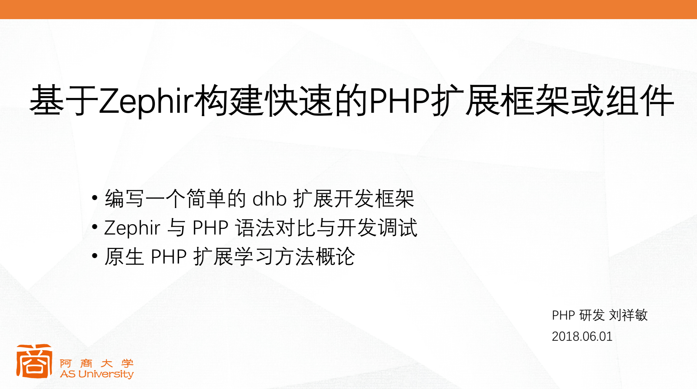
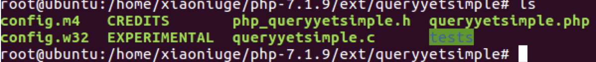
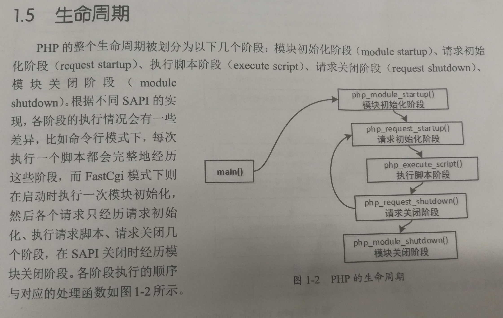
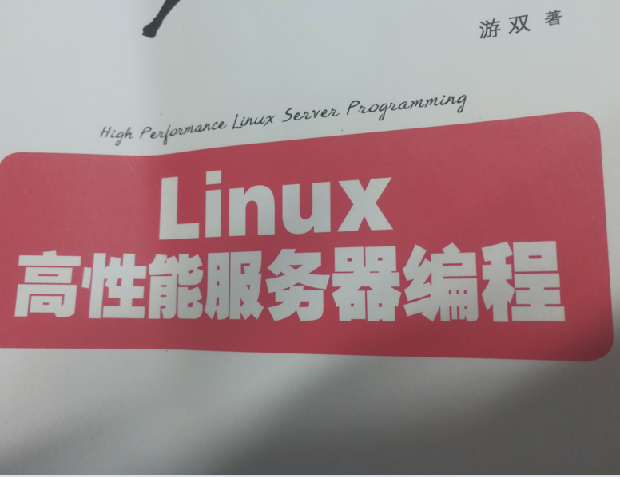
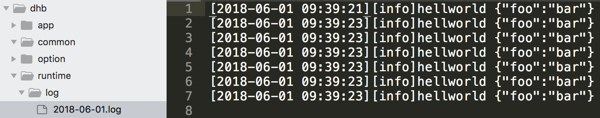

## 关于我

 * 2007 年接触网页三剑客，其实学的 ps，学会基本的flash制作，dw网页表格布局和 ps
 * 2009 初学习 《CSS: The Missing Manual》，《精通 PHP+MYSQL 应用开发.人民邮电出版社》而与PHP结缘
 * 开源爱好者


## Zephir 简介


Zephir 是一个开源的，可以用高级语言安全快速地编写 PHP 的 C 扩展, 2015 年 4 月 Phalcon 2.0 已经改用 Zephir 重写。

Phalcon 是开源、全功能栈、使用 C 扩展编写、针对高性能优化的 PHP 5 框架。Phalcon 和 Yaf 是 C 类扩展开发框架的代表。


## 构建 dhb 框架项目

今天我们基于 Zephir 快速地实现一个简单的 dhb 开发框架来展示一下这门语言的魅力。

这里安装环境我就不写了，大家自行学习搭建，这是第一步，也是重要的一步。

### 当前开发环境

 * php-7.1.6
 * gcc version 5.4.0 20160609
 * Ubuntu 16.04.2 LTS
 * zephir-0.10.7


### 创建一个 dhb 框架

```
zephir init dhb
root@vagrant-ubuntu-10-0-2-5:/data/codes/dhb# ls
dhb
root@vagrant-ubuntu-10-0-2-5:/data/codes/dhb# cd dhb
root@vagrant-ubuntu-10-0-2-5:/data/codes/dhb/dhb# ls
config.json  dhb  ext
```


> dhb 是源代码目录，ext 是扩展目录，扩展既可以采用 zephir 提供的命令行工具来安装，也可以进入 ext 目录进行编译。

```
$/path/to/phpize
$./configure --with-php-config=/path/to/php-config
$make && make install
```

 * php-config 在编译安装 PHP 会将 PHP 的信息写入 php-config,安装路径，编译参数，头文件等
 * phpize 扩展开发比用的一个脚本，主要用于操作复杂的 autoconf/automake等命令用于生成 configure 文件


### 对比传统 PHP 扩展开发

```
./ext_skel --extname=queryyetsimple
```



 * config.m4 autoconf 规则的编译配置文件
 * config.w32 windows 环境的配置
 * queryyetsimple.c 扩展源代码
 * php_queryyetsimple.h 头文件
 * queryyetsimple.php 用于测试扩展在 PHP 是否可用
 * tests 测试用例 make test 将执行

### PHP 扩展（插件）钩子函数

PHP 扩展分为 PHP 扩展和 Zend 扩展，Zend 根据 php_module_startup 将 php.ini 中的 dhb.so 加入到PHP 中。

PHP 为扩展开发定义了 5 个钩子函数来介入 PHP 的不同生命周期，定义完成设置 zend_module_entry 即可。




```
zend_module_entry dhb_module_entry = {
    STANDARD_MODULE_HEADER_EX,
    NULL,
    NULL,
    PHP_DHB_EXTNAME,、//扩展名字
    php_dhb_functions,// 扩展函数列表
    PHP_MINIT(dhb),//模板初始化阶段
#ifndef ZEPHIR_RELEASE
    PHP_MSHUTDOWN(dhb),//模块关闭阶段
#else
    NULL,
#endif
    PHP_RINIT(dhb),//请求初始化阶段 打印 phpinfo()信息
    PHP_RSHUTDOWN(dhb),//请求结束阶段
    PHP_MINFO(dhb),
    PHP_DHB_VERSION,// 扩展版本
    ZEND_MODULE_GLOBALS(dhb),
    PHP_GINIT(dhb),
    PHP_GSHUTDOWN(dhb),
    NULL,
    STANDARD_MODULE_PROPERTIES_EX
};
```

#### 模板初始化阶段

除了注册类，扩展在此阶段可以覆盖 PHP 编译、执行的两个函数指针 zend_compile_file、zend_execute_ex，从而接管 PHP 的编译和执行。

 * opcache 的原理就是自定义了编译函数，对编译结果进行缓存。
 * PHP-AOP 无侵入式面向切面变成也是在这个阶段介入到生成 PHP 抽象语法树动态插入节点。
 * swoole (PHP 网络通信引擎) 扩展也是在这个地方接管了 PHP，进入 Epoll 轮询。
 * PHP 源代码加密扩展

epoll是Linux内核提供的一个多路复用I/O模型，它提供和poll函数一样的功能：监控多个文件描述符是否处于I/O就绪状态（可读、可写）。这就是异步最核心的表现：程序不是主动等待一个描述符可以操作，而是当描述符可操作时由系统提醒程序可以操作了，程序在被提醒前可以去做其他的事情



注册扩展类。


```
static PHP_MINIT_FUNCTION(dhb)
{
    REGISTER_INI_ENTRIES();
    zephir_module_init();
    ZEPHIR_INIT(Dhb_Di_IContainer);
    ZEPHIR_INIT(Dhb_Kernel_IKernel);
    ZEPHIR_INIT(Dhb_Log_ILog);
    ZEPHIR_INIT(Dhb_Option_IOption);
    ZEPHIR_INIT(Dhb_Router_IRouter);
    ZEPHIR_INIT(Dhb_Http_Bag);
    ZEPHIR_INIT(Dhb_Http_Response);
    ZEPHIR_INIT(Dhb_Di_Container);
    ZEPHIR_INIT(Dhb_Di_NormalizeException);
    ZEPHIR_INIT(Dhb_Di_Provider);
    ZEPHIR_INIT(Dhb_Hello_World);
    ZEPHIR_INIT(Dhb_Http_HeaderBag);
    ZEPHIR_INIT(Dhb_Http_JsonResponse);
    ZEPHIR_INIT(Dhb_Http_Request);
    ZEPHIR_INIT(Dhb_Kernel_Kernel);
    ZEPHIR_INIT(Dhb_Log_Log);
    ZEPHIR_INIT(Dhb_Option_Option);
    ZEPHIR_INIT(Dhb_Router_Router);
    return SUCCESS;
}
```

#### 请求初始化阶段

此函数在编译、执行之前回调，fpm 模式下每一个请求都是一个 request,可以对数据进行解密解析。

```
static PHP_RINIT_FUNCTION(dhb)
{

    zend_dhb_globals *dhb_globals_ptr;
#ifdef ZTS
    tsrm_ls = ts_resource(0);
#endif
    dhb_globals_ptr = ZEPHIR_VGLOBAL;

    php_zephir_init_globals(dhb_globals_ptr TSRMLS_CC);
    zephir_initialize_memory(dhb_globals_ptr TSRMLS_CC);

    zephir_init_static_properties_Dhb_Http_Response(TSRMLS_C);
    zephir_init_static_properties_Dhb_Router_Router(TSRMLS_C);

    return SUCCESS;
}
```

#### 请求结束阶段

对应请开始，请求结束时调用,对应 php_request_shutdown。

```
static PHP_RSHUTDOWN_FUNCTION(dhb)
{
    
    zephir_deinitialize_memory(TSRMLS_C);
    return SUCCESS;
}
```

#### post deactviate 阶段

晚于请求结束阶段执行， main/mian.c

```
/* {{{ php_request_shutdown
 */
void php_request_shutdown(void *dummy)
{
    ....

    /* 11. Call all extensions post-RSHUTDOWN functions */
    zend_try {
        zend_post_deactivate_modules();
    } zend_end_try();
}
```


#### 模块关闭阶段

进入模块清理阶段。

```
static PHP_MSHUTDOWN_FUNCTION(dhb)
{
    zephir_deinitialize_memory(TSRMLS_C);
    UNREGISTER_INI_ENTRIES();
    return SUCCESS;
}
```


### 项目配置文件

系统会自动创建一个标准的 zephir 项目，其中 config.json 就是这个项目的配置，相当于 Composer 的 composer.json 和 npm 中的 package.json，其中最重要的是命名空间 `namespace`, 项目遵循 `Psr4` 规则，代码风格推荐使用 `Psr2`。

```
    "namespace": "dhb",
    "name": "dhb",
    "description": "The framework for dhb.",
    "author": "rsung",
    "version": "0.0.1",
```


## 构建框架结构

为了更好地搭建整个框架，我们需要调整一下整个项目的目录结构，初始化两个 composer 项目，一个 dhb/app,一个框架 dhb/framework。


### dhb/app 配置文件 

位于 `/data/codes/dhb/composer.json`

```
{
    "name": "dhb/app",
    "description": "dhb app",
    "authors": [
        {
            "name": "rsung.com",
            "email": "test@qq.com"
        }
    ],
    "require": {}
}
```

### dhb/framework 配置文件 

位于 `/data/codes/dhb/vendor/dhb/framework/composer.json`

```
{
    "name": "dhb/framework",
    "description": "dhb framework",
    "authors": [
        {
            "name": "rsung",
            "email": "test@rsung.com"
        }
    ],
    "require": {}
}
```

## 搭建 phpunit 测试框架

基础组件需要经过单元测试覆盖才能够保证代码质量，这里我们扩展部分的单元测试也使用 phpunit,我们不使用 phpt 那种测试方式.

修改框架的 composer, 安装两个包，phpunit/phpunit 和 nunomaduro/collision，第一个是测试框架，第二个友好地调试 phpunit 异常。

```
{
    "name": "dhb/framework",
    "description": "dhb framework",
    "authors": [
        {
            "name": "rsung",
            "email": "test@rsung.com"
        }
    ],
    "require": {
        "php": "^7.1.3",
        "nunomaduro/collision": "~2.0"
    },
    "require-dev": {
        "phpunit/phpunit": "~7.0"
    }
}
```

### 安装好 composer install，然后添加 phpunit.xml 和 tests 目录，新建 bootstrap.php 启动文件。

位于 `/data/codes/dhb/vendor/dhb/framework/phpunit.xml`


```
<?xml version="1.0" encoding="UTF-8"?>
<phpunit
    backupGlobals="false"
    backupStaticAttributes="false"
    bootstrap="tests/bootstrap.php"
    colors="true"
    convertErrorsToExceptions="true"
    convertNoticesToExceptions="true"
    convertWarningsToExceptions="true"
    processIsolation="false"
    stopOnFailure="false"
    syntaxCheck="false">
    <listeners>
        <listener class="NunoMaduro\Collision\Adapters\Phpunit\Listener" />
    </listeners>
    <testsuites>
        <testsuite name="Application Test Suite">
            <directory>./tests/</directory>
        </testsuite>
    </testsuites>
    <filter>
        <whitelist>
            <directory suffix=".php">./</directory>
            <exclude>
                <directory suffix=".php">tests</directory>
                <directory suffix=".php">vendor</directory>
            </exclude>
        </whitelist>
    </filter>
    <php>
        <env name="APP_ENV" value="testing"/>
        <env name="CACHE_DRIVER" value="array"/>
        <env name="SESSION_DRIVER" value="array"/>
        <env name="QUEUE_DRIVER" value="sync"/>
    </php>
</phpunit>
```

位于 `/data/codes/dhb/vendor/dhb/framework/tests/bootstrap.php`

```php
<?php declare(strict_types=1);

error_reporting(-1);

ini_set('xdebug.max_nesting_level', '200');

ini_set('memory_limit', '512M');

$vendorDir = __DIR__ . '/../vendor';

if (false === is_file($vendorDir . '/autoload.php')) {
    throw new Exception('You must set up the project dependencies, run the following commands:
        wget http://getcomposer.org/composer.phar
        php composer.phar install');
} else {
    include $vendorDir . '/autoload.php';
}

spl_autoload_register(function($class) {
    if (0 === stripos($class, 'Tests\\')) {
        $path = __DIR__ . '/' . strtr(substr($class, 5), '\\', '/') . '.php';
        
        if (is_file($path) === true && is_readable($path) === true) {
            require_once $path;

            return true;
        }
    }
});

```

### 编写一个简单的单元测试文件看看 phpunit 是否正常工作

位于 `/data/codes/dhb/vendor/dhb/framework/tests/HelloTest.php`


```php 
<?php declare(strict_types=1);

namespace Tests;

use PHPUnit\Framework\TestCase;

class HelloTest extends TestCase
{

    public function testFoo()
    {
        $this->assertEquals('foo', 'foo');
    }
}

```

使用 php vendor/bin/phpunit tests/HelloTest.php 运行一下


## 编写第一个扩展类

我们从一个经典的 hello world 开始我们的项目，并且搭建整个扩展开发的环境。

### 编写一个 hello 的组件

位于 `/data/codes/dhb/vendor/dhb/framework/c/dhb/hello/world.zep`

```
namespace Dhb\Hello;

class World
{
    public function welcome() -> string 
    {
        return "hello dhb framework";
    }
}
```

进入扩展目录，编译并且安装

```
root@vagrant-ubuntu-10-0-2-5:/data/codes/dhb/vendor/dhb/framework/c# zephir build
make: Warning: File 'clean' has modification time 622 s in the future
make: warning:  Clock skew detected.  Your build may be incomplete.
Preparing for PHP compilation...
Preparing configuration file...
Compiling...
Installing...
Extension installed!
Add extension=dhb.so to your php.ini
Don't forget to restart your web server
```

### PHP 环境加入 dhb 扩展

修改 php.ini 加入 extendsion = dhb.so


使用 php -m 看看扩展是否安装,如你所见一切 OK


### 编写 hello 组件的单元测试

开发组件的时候，单元测试即是测试调试我们开发，不会有重启 php-fpm 这种操作。

编写一个简单的单元测试

位于 `/data/codes/dhb/vendor/dhb/framework/tests/Hello/WorldTest.php`

```
<?php declare(strict_types=1);

namespace Tests\Hello;

use PHPUnit\Framework\TestCase;
use Dhb\Hello\World;

class WorldTest extends TestCase
{

    public function testWelcome()
    {
        $this->assertEquals('hello dhb framework', (new World)->welcome());
    }
}

```


运行单元测试文件，测试成功

```
php vendor/bin/phpunit tests/Hello/WorldTest.php 
PHPUnit 7.1.5 by Sebastian Bergmann and contributors.

.                                                                   1 / 1 (100%)

Time: 345 ms, Memory: 4.00MB

OK (1 test, 1 assertion)
```

### 编译说明

todo


## 开始造框架基础组件之 IOC 容器

编写一个 zephir 版本的 IoC 容器，用于管理框架服务，实现 PHP 依赖注入。容器实现比较复杂，这里造好了，有兴趣的去看一下。

位于 `/data/codes/dhb/vendor/dhb/framework/c/dhb/di` 目录,包含 4 个文件

```
container.zep 容器
icontainer.zep 容器接口
normalizeexception.zep 容器异常
provider.zep 容器服务提供者
```

为容器编写单元测试文件

位于 `/data/codes/dhb/vendor/dhb/framework/tests/Di/ContainerTest.php`

运行单元测试文件，测试成功

```
root@vagrant-ubuntu-10-0-2-5:/data/codes/dhb/vendor/dhb/framework# php vendor/bin/phpunit tests/Di/ContainerTest.php 
PHPUnit 7.1.5 by Sebastian Bergmann and contributors.

.......................                                           23 / 23 (100%)

Time: 270 ms, Memory: 4.00MB

OK (23 tests, 62 assertions)
```

## 开始造框架基础组件之配置

应用程序需要配置来封装服务，这个时候需要一个基本用于管理基本配置文件的组件。

位于 `/data/codes/dhb/vendor/dhb/framework/c/dhb/option` 目录,包含 2 个文件

```
option.zep 配置文件
ioption.zep 配置接口
```

为配置编写单元测试文件

位于 `/data/codes/dhb/vendor/dhb/framework/tests/Option/OptionTest.php`

运行单元测试文件，测试成功

```
root@vagrant-ubuntu-10-0-2-5:/data/codes/dhb/vendor/dhb/framework# php vendor/bin/phpunit tests/Option/OptionTest.php
PHPUnit 7.1.5 by Sebastian Bergmann and contributors.

.......                                                             7 / 7 (100%)

Time: 249 ms, Memory: 4.00MB

OK (7 tests, 46 assertions)
```

## 开始造框架基础组件之日志组件

框架需要自己的日志组件，记录系统运行的错误。

位于 `/data/codes/dhb/vendor/dhb/framework/c/dhb/log` 目录,包含 2 个文件

```
log.zep 日志文件
ilog.zep 日志接口
```

为日志组件编写单元测试文件

位于 `/data/codes/dhb/vendor/dhb/framework/tests/Log/LogTest.php`

运行单元测试文件，测试成功

```
root@vagrant-ubuntu-10-0-2-5:/data/codes/dhb/vendor/dhb/framework# php vendor/bin/phpunit tests/Log
PHPUnit 7.1.5 by Sebastian Bergmann and contributors.

..                                                                  2 / 2 (100%)

Time: 250 ms, Memory: 4.00MB

OK (2 tests, 3 assertions)
```


## 开始造框架基础组件之 HTTP 组件

HTTP 组件是框架必须的基础组件，这里编写 HTTP 组件。

位于 `/data/codes/dhb/vendor/dhb/framework/c/dhb/http` 目录,包含 5 个文件

```
bag.zep 参数包装文件
headerbag.zep header 包装
jsonrepsonse.zep json 响应
request.zep 请求
response.zep 基础响应
```

为 HTTP 组件编写单元测试文件

位于 `/data/codes/dhb/vendor/dhb/framework/tests/Http`

运行单元测试文件，测试成功

```
root@vagrant-ubuntu-10-0-2-5:/data/codes/dhb/vendor/dhb/framework# php vendor/bin/phpunit tests/Http
PHPUnit 7.1.5 by Sebastian Bergmann and contributors.

.......................................                           39 / 39 (100%)

Time: 294 ms, Memory: 4.00MB

OK (39 tests, 88 assertions)
```

## 开始造框架基础组件之 Kernel 组件

传入 Request,返回 Response，这就是内核组件的责任。

位于 `/data/codes/dhb/vendor/dhb/framework/c/dhb/kernel` 目录,包含 2 个文件

```
kernel.zep 内核
ikernel.zep 内核接口
```

为 Kernel 组件编写单元测试文件

位于 `/data/codes/dhb/vendor/dhb/framework/tests/Kernel/KernelTest.php`

运行单元测试文件，测试成功

```
root@vagrant-ubuntu-10-0-2-5:/data/codes/dhb/vendor/dhb/framework# php vendor/bin/phpunit tests/Kernel/KernelTest.php 
PHPUnit 7.1.5 by Sebastian Bergmann and contributors.

.                                                                   1 / 1 (100%)

Time: 235 ms, Memory: 4.00MB

OK (1 test, 1 assertion)
```

此时，我们 Kernel 组件还非常地弱小，测试一下。

```
namespace Dhb\Kernel;

use Dhb\Http\Request;
use Dhb\Http\Response;
use Dhb\Kernel\IKernel;

class Kernel implements IKernel
{
    /**
     * 响应 HTTP 请求
     *
     * @param \Dhb\Http\Request $request
     * @return \Dhb\Http\Response
     */
    public function handle(<Request> request)-> <Response>
    {
        return new Response("hello world");
    }
}
```

后续我们将继续扩展这个组件，我们开始在应用层接入框架来看看。


## 搭建应用

框架部分基础搭建完毕后面继续，这里开始去搭建应用部分。


### 搭建应用入口文件

位于 `/data/codes/dhb/www/index.php`,内容如下

```php
<?php declare(strict_types=1);

use Dhb\Http\Request;
use Dhb\Kernel\Ikernel;
use Dhb\Kernel\kernel;
use Dhb\Di\Container;
use Dhb\Di\IContainer;

// composer
require_once __DIR__ . '/../vendor/autoload.php';

// 注册基础服务
$container = Container::singletons();

$container->singleton('container', $container);

$container->alias('container', [
    IContainer::class,
    Container::class
]);

function app($server = null, array $args = [])
{
    if ($server === null) {
        return Container::singletons();
    } else {
        return Container::singletons()->make($server, $args);
    }
}

$container->singleton(IKernel::class, Kernel::class);

$request = Request::createFromGlobals();

$container->singleton('request', $request);

$container->alias('request', Request::class);

// 执行调度
$kernel = $container->make(IKernel::class);

$response = $kernel->handle($request);

$response->send();
```

为了方便访问，搭建 nginx 站点，指向我们的 `/data/codes/dhb/www`，并且配置一个 dhbframework.cn 的域名 host 一下:

```
server {
    add_header HostName chengdu-vm02;
    listen 8080;
    server_name dhbframework.cn;
    error_log  /var/log/nginx/q.error.log;
    access_log /var/log/nginx/q.access.log main;
    root /data/codes/dhb/www;
    index  index.html index.php;

    try_files $uri $uri/ @rewrite;

    location @rewrite {
        rewrite ^/(.*)$ /index.php?_url=/$1;
    }

    location ~ \.php$ {
        fastcgi_pass  127.0.0.1:9002;
        fastcgi_index  index.php;
        fastcgi_param  SCRIPT_FILENAME $document_root$fastcgi_script_name;
        include fastcgi_params;
    }

    location ~ \.(md|json)$ {
        deny all;
    }

    location ~ /status$ {
        stub_status on;
        allow  all;
    }
}
```

重启 nginx 和 php-fpm，注意修改框架每次都需要重启 php-fpm，因为 PHP 扩展会常驻内存。

```
service nginx restart
service php716-fpm restart
```


### 开始造框架基础组件之 路由组件

传入 Request,返回 Response，路由分发。

位于 `/data/codes/dhb/vendor/dhb/framework/c/dhb/router` 目录,包含 2 个文件

```
router.zep 路由
irouter.zep 路由接口
```

为 路由 组件编写单元测试文件

位于 `/data/codes/dhb/vendor/dhb/framework/tests/Router/RouterTest.php`

路由的单元测试时空的，后面自行可以完善，路由只提供了一个 dispach 方法来分发路由

```
/**
 * 分发请求到路由
 *
 * @param \Dhb\Http\Request $request
 * @return \Dhb\Http\Response
 */
public function dispatch(<Request> request);
```

### 入口文件注入路由到容器

位于 `/data/codes/dhb/www/index.php`

```php 
use Dhb\Router\Router;
use Dhb\Router\IRouter;

...

$container->singleton('router', new Router($container));

$container->alias('router', [
    IRouter::class,
    Router::class
]);
```

修改我们的 kernel ，搭建路由调度。

位于 `/data/codes/dhb/vendor/dhb/framework/c/dhb/kernel/kernel.zep`

```
namespace Dhb\Kernel;

use Dhb\Http\Request;
use Dhb\Http\Response;
use Dhb\Kernel\IKernel;
use Dhb\Router\IRouter;

class Kernel implements IKernel
{

    /**
     * 路由
     *
     * var \Dhb\Router\IRouter
     */ 
    protected router;

    /**
     * 构造函数
     *
     * @param \Dhb\Router\IRouter $router
     */
    public function __construct(<IRouter> router)
    {
        let this->router = router;
    }

    /**
     * 响应 HTTP 请求
     *
     * @param \Dhb\Http\Request $request
     * @return \Dhb\Http\Response
     */
    public function handle(<Request> request)-> <Response>
    {
        var response;

        let response = this->router->dispatch(request);

        return response;
    }
}
```

然后访问首页 `http://dhbframework.cn` 将报错

```html 
<br />
<b>Fatal error</b>:  Uncaught InvalidArgumentException: The node App\App\Controller\Home-&gt;handle() is not found. in /data/codes/dhb/www/index.php:51
Stack trace:
#0 [internal function]: Dhb\Router\Router-&gt;nodeNotFound()
#1 [internal function]: Dhb\Router\Router-&gt;matchRouter()
#2 [internal function]: Dhb\Router\Router-&gt;dispatch(Object(Dhb\Http\Request))
#3 /data/codes/dhb/www/index.php(51): Dhb\Kernel\Kernel-&gt;handle(Object(Dhb\Http\Request))
#4 {main}
  thrown in <b>/data/codes/dhb/www/index.php</b> on line <b>51</b><br />
```

然后访问例外一个地址 `http://dhbframework.cn/hello/world?id=1` 将报错

```html 
<br />
<b>Fatal error</b>:  Uncaught InvalidArgumentException: The node App\App\Controller\Hello-&gt;world() is not found. in /data/codes/dhb/www/index.php:51
Stack trace:
#0 [internal function]: Dhb\Router\Router-&gt;nodeNotFound()
#1 [internal function]: Dhb\Router\Router-&gt;matchRouter()
#2 [internal function]: Dhb\Router\Router-&gt;dispatch(Object(Dhb\Http\Request))
#3 /data/codes/dhb/www/index.php(51): Dhb\Kernel\Kernel-&gt;handle(Object(Dhb\Http\Request))
#4 {main}
  thrown in <b>/data/codes/dhb/www/index.php</b> on line <b>51</b><br />
```


我们的路由组件已经起作用了，因为没有接管异常所以系统抛出了异常，接下来编写控制器。

### 编写控制器

为应用添加一个 psr4，App 的命名空间。

位于 `/data/codes/dhb/composer.json`

```
"autoload": {
    "psr-4": {
        "App\\": "app/"
    }
}

...

composer dump-autoload -o
```

访问地址 `http://dhbframework.cn`
位于 `/data/codes/dhb/app/App/App/Controller/Home.php`

```php 
<?php declare(strict_types=1);

namespace App\App\Controller;

class Home
{

    public function handle()
    {
        return ['home' => 'world'];
    }
}
```

响应


```
{"home":"world"}
```


访问地址 `http://dhbframework.cn/hello/world?id=222`
位于 `/data/codes/dhb/app/App/App/Controller/Hello.php`

```php 
<?php declare(strict_types=1);

namespace App\App\Controller;

class Hello
{

    public function world()
    {
        return ['hello is' => app('request')->query->get('id', 'deafult')];
    }
}
```

响应


```
{"hello is":"222"}
```

访问地址 `http://dhbframework.cn/world/hello`
位于 `/data/codes/dhb/app/App/App/Controller/World/Hello.php`

```php 
<?php declare(strict_types=1);

namespace App\App\Controller\World;

class Hello
{

    public function handle()
    {
        return 'acton class with handle';
    }
}
```

响应


```
acton class with handle
```

访问地址 `http://dhbframework.cn/foo/bar/c/a`
位于 `/data/codes/dhb/app/App/App/Controller/Foo/Bar/C.php`

```php
<?php declare(strict_types=1);

namespace App\App\Controller\Foo\Bar;

class C 
{

    public function a()
    {
        return 'Hello i am here App\App\Controller\Foo\Bar\A->c()';
    }
}
```

响应


```
Hello i am here App\App\Controller\Foo\Bar\A->c()
```

访问地址 `http://dhbframework.cn/goods/111/show`
位于 `/data/codes/dhb/app/App/App/Controller/Goods.php`

```php
<?php declare(strict_types=1);

namespace App\App\Controller;

use Dhb\Http\Request;

class Goods
{

    public function show(Request $request)
    {
        return ['goods-id' => $request->params->get('_param0')];
    }
}
```

响应


```
{"goods-id":"111"}
```

## 框架接入日志服务

位于 `/data/codes/dhb/www/index.php`,内容如下

```php
use Dhb\Log\ILog;
use Dhb\Log\Log;

...

$container->singleton('log', new Log([
    'path' => dirname(__DIR__) . '/runtime/log'
]));

$container->alias('log', [
    ILog::class,
    Log::class
]);
```


位于 `/data/codes/dhb/app/App/App/Controller/Home.php`

```php
<?php declare(strict_types=1);

namespace App\App\Controller;

class Home
{

    public function handle()
    {
        app('log')->info('hellworld', ['foo' => 'bar']);

        return ['home' => 'world'];
    }
}
```

访问地址 `http://dhbframework.cn`,刷新几次。




## 接入配置服务

位于 `/data/codes/dhb/option`,两个配置文件 app.php,extend.php

```php
<?php 

return [
    // true or false
    'debug' => true,

    'environment' => 'development'
];
```

and

```php
<?php 

return [
    'foo' => 'bar'
];
```

将这些配置注入到配置组件中

位于 `/data/codes/dhb/www/index.php`,内容如下

```php
use Dhb\Option\IOption;
use Dhb\Option\Option;

...

$container->singleton('option', 
    call_user_func(function() {
        $data = [];

        foreach(glob(dirname(__DIR__) . '/option/*.php') as $file) {
            $type = substr(basename($file), 0, -4);
            $data[$type] = (array)include $file;
        }

        return new Option($data);
    })
);

$container->alias('option', [
    IOption::class,
    Option::class
]);

function option(?string $name = null)
{
    return null === $name ? app('option') : app('option')->get($name);
}

function debug(): bool
{
    return option('debug');
}

/*
var_dump(debug());// bool(true)
print_r(option('environment'));// development
print_r(option('extend\foo')); // bar
*/
```

## 接管 PHP 异常和错误

忽略不存在类和函数编译警告


```
"nonexistent-function": false,
"nonexistent-class": false,
```


为了后期方便调试，dhb/app 加入调试包

```
 "nunomaduro/collision": "~2.0" 
```

定义 Dhb\Kernel\HttpException 异常

```
namespace Dhb\Kernel;

use Exception;
use RuntimeException;

class HttpException extends RuntimeException
{

    /**
     * HTTP 状态
     *
     * @var int
     */
    protected statusCode {
        get, set
    };

    /**
     * Header
     *
     * @var array
     */
    protected headers = [] {
        get, set
    };

    /**
     * 构造函数
     *
     * @param int $statusCode
     * @param string|null $message
     * @param integer $code
     * @param \Exception $previous
     * @return void
     */
    public function __construct(int statusCode, var message = null, int code = 0, <Exception> previous = null)
    {
        let this->statusCode = statusCode;
        parent::__construct(message, code, previous);
    }
}
```

定义异常处理，异常处理接入日志 Dhb\Kernel\Runtime 和 Dhb\Kernel\IRuntime

```
namespace Dhb\Kernel;

use Dhb\Http\Response;

interface IRuntime
{

    /**
     * 响应异常
     *
     * @param \Exception $e
     * @return \Dhb\Http\Response
     */
    public function handle(var e) -> <Response>;
}
```

修改 Dhb\Kernel\Kernel 接管异常,首页将异常处理加入容器

```
use Dhb\Kernel\IRuntime;
use Dhb\Kernel\Runtime;

...

$container->singleton(IRuntime::class, Runtime::class);
```

修改首页控制器，抛个异常

```
 //throw new \Dhb\Kernel\HttpException(404, '404 not found');
 throw new \Exception('hello exception');
```


修改 option/app.php 中的 debug 来查看异常的不同展示，同时看看日志是否记录了错误。


到这里整个框架完毕。

## zephir 与 PHP 对比与调试

语法非常接近，可以复用所有 PHP 的对象知识几乎，调用 PHP 内置方法。没有美元符号，变量使用必须要定义，定义多了会有警告。

```
var a;
let a = 1;
let a++;
```

不存在内存管理和指针（PHP 引用&）

支持返回值和参数类型提示符,名字传值

```
public function setConnection(connection) -> void
{
    let this->_connection = connection;
}

public function doSum4(int a, int b)
{
    return a + b;
}

class Image
{
    public function chop(width = 600, height = 400, x = 0, y = 0)-> void
    {
        //...
    }
}

i->chop(height: 200, width: 100);
```

数组差异,关联数组是map ，js对象这种

```
let myArray = [1, 2, 3];

//Double colon must be used to define hashes' keys
let myHash = ["first": 1, "second": 2, "third": 3];
```


不支持 trait,可以采用接口代替

支持简单闭包（不支持this和use），可以使用 Closure::fromCallable 代替

```
protected function caches()
{
    this->container->singleton("caches", Closure::fromCallable([this, "cachesClosure"]));
}

protected function cachesClosure(var project)
{
    return new Manager(project);
}
```

支持动态和静态变量

```
int a,b;
array c;
var d;
```

getter/setter支持

```
namespace App;

class MyClass
{
    protected someProperty = 10 {
        set, get
    };
}
```

只能以对象呈现,伪一切皆对象,内置方法

```
s->length()
s->trim()
s->lower()
a->join(" ")
a->keys()
ch->toHex()
i->abs()
```

instanceof 不支持右动态变量

```
if (! self::zephirInstanceof) {
        eval("if (! function_exists('zephir_instanceof')) {
            function zephir_instanceof($value, $type) {
                return $value instanceof $type;
            }
        }");

        let self::zephirInstanceof = true;
    }

return zephir_instanceof(value, type);
```

不支持 switch(true) 这种只能以 if elseif 来搞

模板引擎需要用，动态添加变量到符号表

```
for key, value in vars {
    let {key} = value;
}
```

动态指定属性不支持 unset 

```
public function remove($name)
{
    $name = $this->normalize($name);

    $prop = [
        'services',
        'instances',
        'singletons'
    ];

    foreach ($prop as $item) {
        if (isset($this->{$item}[$name])) {
            unset($this->{$item}[$name]);
        }
    }
}

vs

public function remove(var name)
{
    let name = this->normalize(name);

    if isset this->services[name] {
        unset this->services[name];
    }

    if isset this->instances[name] {
        unset this->instances[name];
    }

    if isset this->instances[name] {
        unset this->instances[name];
    }
}
```

绑定闭包到类与PHP有点出入，无法访问 protected和private属性

```
/**
 * __callStatic 魔术方法隐射
 * 由于 zephir 对应的 C 扩展版本不支持对象内绑定 class
 * 即 Closure::bind($closures, null, get_called_class())
 * 为保持功能一致，所以取消 PHP 版本的静态闭包绑定功能
 *
 * @param string $method
 * @param array $args
 * @return mixed
 */
public static function callStaticMacro(string method, array args)
{
    if self::hasMacro(method) {
        return call_user_func_array(self::macro[method], args);
    }

    throw new BadMethodCallException(sprintf("Method %s is not exits.", method));
}

/**
 * __call 魔术方法隐射
 * 由于 zephir 对应的 C 扩展版本不支持对象内绑定 class
 * 即 Closure::bind($closures, null, get_called_class())
 * 为保持功能一致，所以绑定对象但是不绑定作用域，即可以使用 $this,只能访问 public 属性
 * 
 * @param string $method
 * @param array $args
 * @return mixed
 */
public function callMacro(string method, array args)
{
    if self::hasMacro(method) {
        if self::macro[method] instanceof Closure {
            return call_user_func_array(self::macro[method]->bindTo(this), args);
        } else {
            return call_user_func_array(self::macro[method], args);
        }
    }

    throw new BadMethodCallException(sprintf("Method %s is not exits.", method));
}
```

eval 动态插入符号表不支持，需要调用 PHP自身

```
if (! self::zephirAssign) {
    eval("if (! function_exists('zephir_assign')) {
        function zephir_assign($value, $evals) {
            eval($evals);
            return $value;
        }
    }");

    let self::zephirAssign = true;
}
```

不支持函数内置静态变量，只支持类属性

```
public function share(Closure $closures)
{
    return function ($container) use ($closures) {
        static $obj;

        if (is_null($obj)) {
            $obj = $closures($container);
        }

        return $obj;
    };
}

vs

public function share(<Closure> closures)
{
    let this->shareUseClosures = closures;

    return Closure::fromCallable([this, "shareClosure"]);
}

protected function shareClosure(var container)
{
    var hash, obj;

    let hash = spl_object_hash(this->shareUseClosures);

    if fetch obj, this->shareClosure[hash] {
        return obj;
    }

    let obj = call_user_func(this->shareUseClosures, container);
    let this->shareClosure[hash] = obj;

    return obj;
}
```


### 调试


复用 PHP 自带的技术

```
int a = 1;

dump(a);/ symfony/var_dump
var_dump(a);
print_r(a);
```

编译器能够检测大部分错误,偶尔有时候会 gcc 编译完成报错，能够大约定位

```
compile.log
compile-errors.log
```

## PHP 原生扩展开发渐进

时间有限，到这里了哈，主要是根据 phalcon7 来逐步深入学习。

网站: http://www.myleftstudio.com/

内核开发API: http://www.myleftstudio.com/internals/

Phalcon API 在 Zend API 的基础上实现了 phalcon_call_method_with_params 函数，并以此为基础定义了宏 PHALCON_CALL_FUNCTION，利用这些 API 可以很轻松的调用内核及自定义函数。

```
// $length = strlen(some_variable);
PHALCON_CALL_FUNCTION(&length, "strlen", &some_variable);

// Calling substr() with its 3 arguments returning the substring into "part"
PHALCON_CALL_FUNCTION(&part, "substr", &some_variable, &start, &length);

// Calling ob_start(), this function does not return anything
PHALCON_CALL_FUNCTION(NULL, "ob_start");

// Closing a file with fclose
PHALCON_CALL_FUNCTION(NULL, "fclose", file_handler);
```

and 

```
ZVAL_STRING(&mode, "w");

PHALCON_CALL_FUNCTION(&file_handler, "fopen", &file_path, &mode);

if (PHALCON_IS_NOT_FALSE(&file_handler)) {
        ZVAL_STRING(&text, "fopen example");

        PHALCON_CALL_FUNCTION(NULL, "fputs", &file_handler, &text);

        PHALCON_CALL_FUNCTION(NULL, "fclose", &file_handler);
}

vs 

<?php

$fp = fopen($file_path, "w");
if($fp){
        fputs($fp, "fopen example");
        fclose($fp);
}
```

## 完毕

Thank s!

